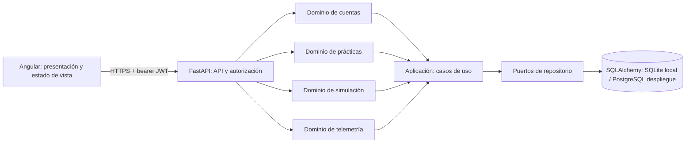

# Arquitectura y backlog del simulador GALIX PACESTAR

## Propósito y límites

Herramienta educativa para estudiantes de Ingeniería Biomédica de la Universidad ECCI. La simulación sirve para practicar programación de estimulación cardíaca en escenarios controlados; no es un dispositivo médico, no brinda recomendaciones para pacientes y no sustituye supervisión docente ni criterio clínico.

## Decisión de arquitectura

Se recomienda una arquitectura modular por dominios, con Angular como cliente, FastAPI como API y persistencia aislada detrás de repositorios. El backend no debe convertirse en un único módulo que acumule autenticación, cálculos, persistencia y respuestas HTTP. Para el alcance académico actual conviene desplegar la API como un servicio y mantener límites internos claros; microservicios independientes añadirían operación, red y consistencia distribuida sin una necesidad demostrada. Cada dominio podrá extraerse a un servicio cuando tenga equipo, carga y ciclo de despliegue propios.

### Responsabilidades y ubicación

| Capa | Responsabilidad | Ubicación objetivo |
|---|---|---|
| Presentación | Componentes standalone, formularios, navegación, visualización ECG | `frontend/src/app/components`, `frontend/src/app/features`, `frontend/src/app/services` |
| API | HTTP, validación de entrada, autenticación y códigos de respuesta | `backend/api/routers` |
| Aplicación | Casos de uso: registrar usuario, abrir/cerrar práctica, evaluar y consultar historial | `backend/application` |
| Dominio | Reglas y modelos de cuentas, escenarios, simulación y telemetría | `backend/domains/{accounts,practice,simulation,telemetry}` |
| Infraestructura | SQLAlchemy, configuración, repositorios, JWT y hash | `backend/infrastructure` |
| Contratos | Schemas de entrada/salida, versionados junto a la API | `backend/api/schemas` |
| Calidad | Pruebas unitarias, integración, accesibilidad y seguridad | `backend/tests`, `frontend/src/**/*.spec.ts` |
| Producto | Historias de usuario, arquitectura y decisiones | `docs` |

La estructura objetivo se puede adoptar gradualmente conservando los contratos actuales. Los routers existentes ya están separados por recurso, pero todavía contienen consultas y parte de los casos de uso; extraer esas operaciones a `application` y repositorios es trabajo de arquitectura pendiente, no se presenta como terminado.

### Reglas de dependencias

1. La API depende de casos de uso, no implementa reglas clínicas ni puntajes dentro de los endpoints.
2. El dominio no importa FastAPI, Angular ni SQLAlchemy.
3. Los casos de uso dependen de interfaces de repositorio; infraestructura implementa esas interfaces.
4. Angular consume contratos HTTP mediante servicios e interceptor; los componentes no construyen peticiones HTTP.
5. La evaluación de captura y los umbrales por escenario tienen una única fuente de verdad en el dominio de simulación.

## Seguridad y privacidad

- Contraseñas: almacenar hashes Argon2id (no cifrado reversible), con migración al iniciar sesión para hashes bcrypt heredados. Nunca registrar contraseñas ni devolver hashes.
- Autenticación: JWT firmado, expiración corta y clave configurada por entorno. En producción, `JWT_SECRET_KEY` debe ser secreta, estable y gestionada fuera del repositorio; el valor aleatorio de desarrollo invalida tokens al reiniciar el proceso.
- Autorización: comprobar propiedad del recurso en servidor para perfil, prácticas, telemetría e historial; no confiar en `id_usuario` del cliente.
- Validación: límites de rangos y longitud en backend; rechazo por defecto de entradas no válidas. La API calcula el resultado de captura, nunca confía en un booleano enviado por el navegador.
- Transporte y navegador: HTTPS en despliegue, CORS limitado a orígenes conocidos, secretos fuera de código, dependencias actualizadas, mensajes de login que no revelen cuál campo falló y token de acceso en memoria.
- Protección pendiente antes de producción: limitación de intentos de login, política de bloqueo progresivo, gestión/rotación de secretos, configuración TLS, migraciones Alembic, pruebas automatizadas de acceso horizontal, política de retención/borrado y revisión legal de datos personales (Ley 1581 de Colombia).
- Este proyecto no debe guardar información identificable de pacientes reales. Usar únicamente datos ficticios para las prácticas.

## Backlog de producto

Prioridad sugerida: P0 = seguridad y flujo esencial; P1 = aprendizaje e historial; P2 = docencia y expansión. Las historias son una propuesta de alcance; deben estimarse con estudiantes y docentes antes de comprometer una iteración.

### HU-01 — Crear cuenta estudiantil (P0)
**Descripción:** Como estudiante de Ingeniería Biomédica, quiero registrarme con mi nombre y código ECCI para guardar mis prácticas.  
**Criterios de aceptación:** El código estudiantil es único; contraseña de al menos 12 caracteres; el sistema almacena únicamente un hash Argon2id y confirma el registro sin exponer datos sensibles.  
**DoR:** Campos, reglas de validación, mensajes y política de contraseña están aprobados por producto.  
**DoD:** Pruebas de registro válido, duplicado, entradas inválidas y verificación de que la respuesta/BD no exponen la contraseña en claro.

### HU-02 — Iniciar y cerrar sesión (P0)
**Descripción:** Como estudiante registrado, quiero iniciar sesión y salir para que mis prácticas sean privadas.  
**Criterios de aceptación:** Credenciales válidas generan JWT firmado con expiración; inválidas reciben un mensaje genérico; salir elimina el token en memoria.  
**DoR:** Expiración, algoritmo, almacenamiento en navegador y respuestas de error están definidos.  
**DoD:** Pruebas de login correcto/incorrecto, token expirado, cuenta inactiva y cierre de sesión.

### HU-03 — Proteger recursos por propietario (P0)
**Descripción:** Como estudiante, quiero que solo mi cuenta pueda consultar mis sesiones y telemetría.  
**Criterios de aceptación:** Sin token se responde 401; un token de otra cuenta no lee, crea ni finaliza recursos ajenos; la API no confía en el identificador de usuario del cliente.  
**DoR:** Matriz de roles y recursos propios/compartidos está acordada.  
**DoD:** Pruebas de autorización horizontal para perfil, sesión, historial y telemetría.

### HU-04 — Elegir un escenario de práctica (P0)
**Descripción:** Como estudiante, quiero seleccionar un escenario ficticio para practicar con objetivos clínicos distintos.  
**Criterios de aceptación:** Se muestran los escenarios disponibles con descripción y umbral; no se acepta un escenario desconocido; cambiarlo durante una práctica activa requiere detenerla.  
**DoR:** Docente valida nombres, descripciones y supuestos educativos de cada escenario.  
**DoD:** Pruebas de catálogo, selección, escenario inválido y actualización visible.

### HU-05 — Iniciar una práctica (P0)
**Descripción:** Como estudiante, quiero abrir una sesión asociada a un escenario para registrar mi trabajo.  
**Criterios de aceptación:** La sesión pertenece al usuario autenticado, conserva fecha de inicio y queda en curso hasta finalizar.  
**DoR:** Estados, campos persistidos y transición de sesión están definidos.  
**DoD:** Pruebas de creación, propiedad, escenario inválido y estado inicial.

### HU-06 — Ajustar frecuencia de estimulación (P0)
**Descripción:** Como estudiante, quiero ajustar PPM dentro de límites educativos para observar su efecto en el ritmo simulado.  
**Criterios de aceptación:** El control muestra valor y unidad; backend valida 30–200 PPM; el intervalo del ECG se actualiza sin perder la sesión.  
**DoR:** Rango, paso y comportamiento del control están revisados por docente.  
**DoD:** Pruebas de límites inferior/superior y actualización del período del latido.

### HU-07 — Ajustar corriente de salida (P0)
**Descripción:** Como estudiante, quiero cambiar la corriente en mA para observar captura o fallo según el escenario.  
**Criterios de aceptación:** El control muestra el umbral activo; la API evalúa el valor contra el escenario; el cliente no puede falsificar el resultado.  
**DoR:** Umbrales educativos y límites de entrada están documentados y aprobados.  
**DoD:** Pruebas justo debajo, igual y encima de cada umbral en backend y visualización.

### HU-08 — Ajustar sensibilidad (P1)
**Descripción:** Como estudiante, quiero ajustar sensibilidad en mV para explorar detección de señales débiles en el monitor didáctico.  
**Criterios de aceptación:** Rango 0.5–10 mV, unidad siempre visible y actualización inmediata del ruido/señal simulada.  
**DoR:** Se explica qué representa el parámetro y qué simplificaciones tiene el modelo.  
**DoD:** Pruebas de límites, propagación al cálculo y visualización accesible.

### HU-09 — Visualizar ECG en tiempo real (P0)
**Descripción:** Como estudiante, quiero ver una onda ECG animada mientras ajusto el marcapasos para relacionar parámetros con respuesta.  
**Criterios de aceptación:** La señal se adapta a tamaño de pantalla, indica pausa/actividad y conserva contraste; se identifica como señal sintética.  
**DoR:** Convención visual, tasa de actualización y límites pedagógicos definidos.  
**DoD:** Pruebas de render y resize; revisión visual en escritorio/móvil y contraste de estados.

### HU-10 — Identificar captura y fallo (P0)
**Descripción:** Como estudiante, quiero reconocer visualmente captura exitosa y fallo de captura para interpretar el resultado.  
**Criterios de aceptación:** La señal, texto y estado coinciden con la regla del dominio; el fallo no depende solo del color; el umbral se actualiza por escenario.  
**DoR:** Estados, mensajes y regla de decisión validados por el equipo docente.  
**DoD:** Pruebas de los cuatro escenarios, anuncios accesibles y consistencia API/UI.

### HU-11 — Pausar, reanudar y finalizar práctica (P0)
**Descripción:** Como estudiante, quiero controlar el ciclo de simulación y cerrar la sesión cuando termine.  
**Criterios de aceptación:** Pausar congela la animación; reanudar conserva parámetros; finalizar persiste fecha y puntaje y no admite más telemetría.  
**DoR:** Diferencia entre pausa visual y finalización persistente acordada.  
**DoD:** Pruebas de transiciones válidas, doble finalización y escritura después del cierre.

### HU-12 — Registrar telemetría de práctica (P0)
**Descripción:** Como estudiante, quiero que los cambios de parámetros durante una práctica queden registrados para revisar mi proceso.  
**Criterios de aceptación:** Cada registro pertenece a una sesión propia y activa; guarda fecha, PPM, mA, mV y resultado calculado; entradas fuera de rango son rechazadas.  
**DoR:** Frecuencia de captura y campos mínimos están definidos para no guardar eventos redundantes.  
**DoD:** Pruebas de persistencia, validación, propiedad y sesión finalizada.

### HU-13 — Consultar historial propio (P1)
**Descripción:** Como estudiante, quiero seleccionar una práctica anterior, revisar su telemetría y pedir a Noah una explicación para dar seguimiento a mi aprendizaje.  
**Criterios de aceptación:** Se listan ordenadas por fecha con escenario, estado y puntaje; al seleccionar una sesión propia se cargan sus eventos; Noah analiza esos eventos guardados y no los parámetros actuales; otro usuario no puede consultar ni explicar la sesión.  
**DoR:** Orden, paginación y campos visibles están aprobados.  
**DoD:** Pruebas de historial vacío, orden, paginación y autorización.

### HU-14 — Revisar métricas de desempeño (P1)
**Descripción:** Como estudiante, quiero resumir capturas exitosas y fallos para reconocer patrones en mis ajustes.  
**Criterios de aceptación:** Totales y porcentaje se calculan en servidor, definen el caso sin registros y coinciden con el detalle de telemetría.  
**DoR:** Fórmula y tratamiento de sesiones sin eventos definidos.  
**DoD:** Pruebas de agregación, cero registros y consistencia con telemetría.

### HU-15 — Recibir acompañamiento del tutor Noah (P1)
**Descripción:** Como estudiante, quiero que Noah me guíe paso a paso, responda preguntas escritas y explique el puntaje, umbral, capturas, fallos y cambios de parámetros de una sesión que seleccione.  
**Criterios de aceptación:** Noah responde la intención preguntada con métricas y registros de esa sesión calculados por backend; distingue sesión sin telemetría de fallo; indica si usa IA o guía local; no repite mensajes genéricos ni recomienda ajustes para pacientes reales, y no recibe identificadores personales ni JWT.  
**DoR:** Guion pedagógico, proveedor permitido, privacidad, límites de respuesta y revisión docente están definidos.  
**DoD:** Pruebas de guía, explicación de captura/fallo, prompt injection, proveedor caído, modo local, seguridad de datos y aprobación biomédica.

### HU-16 — Comparar escenarios (P1)
**Descripción:** Como estudiante, quiero comparar escenarios para entender cómo cambia la respuesta al estimulo y su umbral.  
**Criterios de aceptación:** Se pueden comparar resultados con las mismas unidades y parámetros; se exponen supuestos y diferencias; no se mezclan registros de usuarios.  
**DoR:** Escenarios comparables y métricas acordadas.  
**DoD:** Pruebas de cálculo comparativo y revisión de exactitud didáctica.

### HU-17 — Exportar informe de práctica (P2)
**Descripción:** Como estudiante, quiero exportar un informe de una sesión para discutirlo en clase.  
**Criterios de aceptación:** El informe contiene fecha, escenario, parámetros, métricas y aviso de simulación; solo incluye datos propios y permite descarga accesible.  
**DoR:** Formato, campos y política de datos aprobados.  
**DoD:** Pruebas de autorización, contenido, descarga y apertura del formato elegido.

### HU-18 — Usar la aplicación con accesibilidad y móvil (P1)
**Descripción:** Como estudiante, quiero operar el simulador con teclado, lector de pantalla y dispositivos pequeños.  
**Criterios de aceptación:** Controles tienen etiquetas y foco visible; estados no dependen solo del color; no hay desbordamiento horizontal esencial en móvil.  
**DoR:** Viewports objetivo y nivel WCAG del curso definidos.  
**DoD:** Revisión automatizada y manual de teclado, contraste, lector de pantalla y móvil.

### HU-19 — Administrar escenarios de curso (P2)
**Descripción:** Como docente, quiero habilitar escenarios y actividades para una cohorte sin modificar el código.  
**Criterios de aceptación:** Solo rol docente autorizado cambia configuración; estudiante solo consulta escenarios activos; todo cambio tiene autor y fecha.  
**DoR:** Roles, permisos y modelo de curso aprobados por ECCI.  
**DoD:** Pruebas de permisos, auditoría y aislamiento entre cursos.

### HU-20 — Operar y mantener el sistema con seguridad (P0)
**Descripción:** Como responsable técnico del curso, quiero configurar, observar y actualizar el sistema de forma reproducible.  
**Criterios de aceptación:** Secretos y URLs provienen del entorno; existen migraciones y health checks; logs no contienen contraseñas/tokens; dependencias y pasos de despliegue están documentados; el sistema pasa una prueba acordada de 800 alumnos simultáneos.  
**DoR:** Entornos, responsables, retención y requisitos legales identificados.  
**DoD:** Build reproducible, pruebas automatizadas en CI, análisis de dependencias, revisión OWASP, prueba de carga de 800 VUs con criterios p95/error aprobados y procedimiento de restauración documentados.

## Entrega actual frente al backlog

Esta intervención refuerza autenticación, propiedad de recursos, verificación de captura en servidor, almacenamiento del token en memoria y la presentación visual ECCI. Las 20 historias describen el alcance total propuesto: funcionalidades como exportación, rol docente, comparador de escenarios, limitación de intentos, migraciones de BD y CI siguen pendientes y no se deben considerar implementadas por estar documentadas aquí.
